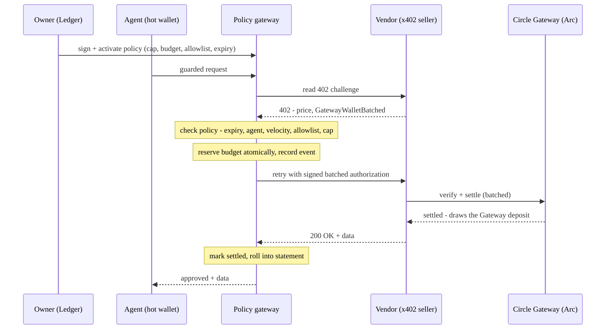
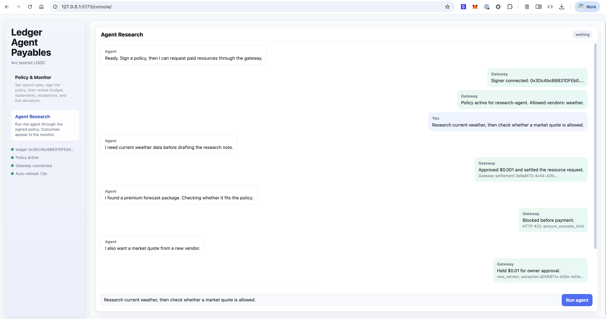
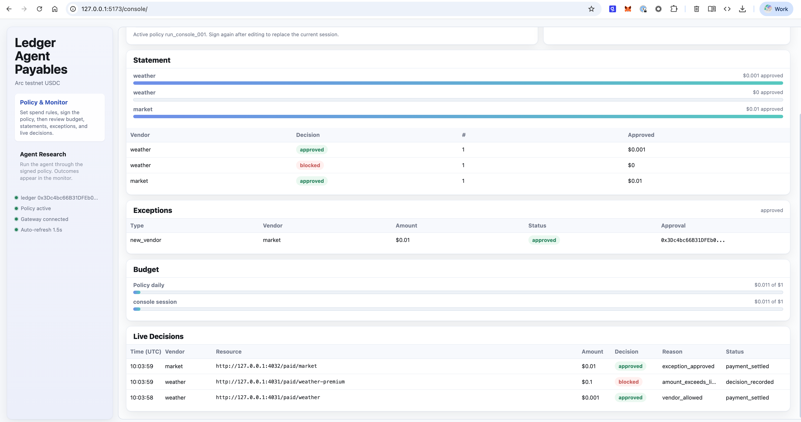
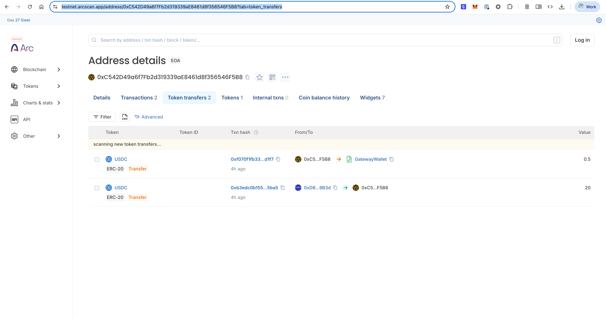

# Ledger Agent Payables

**A Ledger-signed policy control plane for AI-agent USDC nanopayments.**

A human signs one policy on a Ledger — allowed vendors, per-payment cap, daily budget, velocity, expiry — and a gateway enforces it on every agent payment, holds exceptions for human approval, and rolls events into an audit-ready statement.

## Problem

AI agents can now spend money automatically, creating a critical control problem:

- a runaway loop can drain a wallet one nanopayment at a time
- a compromised agent can pay an attacker-controlled endpoint
- raw wallet transactions are not enough for finance or audit

The fix: control moves up a level — a human signs the budget and rules once, and the system enforces them on every payment.

## Who It's For

- **Agent developers** who want to route paid requests through a policy-checked gateway instead of calling paid endpoints directly.
- **Operators** running autonomous research, data, monitoring, or coding agents.
- **Finance and ops teams** that need vendor-level budgets, exceptions, and audit trails.

## How It Works

A human signs spending authority once on a Ledger; the agent's separate hot wallet spends only within that policy, which the gateway enforces on every payment before money moves.

The parties:

- **Owner (Ledger):** signs the policy and exception approvals on the device; never signs individual payments.
- **Agent (hot wallet):** makes paid requests and signs each nanopayment, only within the signed policy. In this demo it's the throwaway buyer wallet from Quickstart step 1.
- **Policy gateway (this project):** checks each request (cap, budget, allowlist, velocity, expiry), reserves budget, holds exceptions, logs events.
- **Vendor (x402 seller):** returns an x402 `402` challenge, then delivers data once paid.
- **Circle Gateway (Arc):** Circle's product; verifies the authorization and batch-settles USDC on Arc.

One guarded payment, end to end:



The same gateway runs on a local mock rail or Circle Arc testnet for real gas-free USDC nanopayments. On the Arc rail the payment is on-chain; the vendor and agent are our own stand-ins (a self-hosted x402 seller and a deterministic agent) so the demo can trigger every policy outcome.

On-chain proof (Arc testnet): the agent wallet's [USDC transfers on Arcscan](https://testnet.arcscan.app/address/0xC542D49a6f7Fb2d319339aE8461d8f356546F5B8?tab=token_transfers) show 20 USDC in from the faucet and 0.5 USDC out to Circle's Gateway Wallet. Nanopayments then draw from that deposit and batch-settle, so they don't each post a transaction.

## Quickstart

Install and run the test suite:

```bash
npm install
npm test            # money-logic + gateway suite
```

### Run it on Circle Arc (testnet USDC)

1. Create and fund a throwaway buyer wallet:

```bash
npm run arc:wallet          # prints the buyer address
# fund that address at https://faucet.circle.com (select Arc Testnet)
npm run arc:wallet:status   # confirm the USDC balance landed
```

2. Start the Arc gateway and the browser console in two separate terminals:

```bash
# terminal 1 — gateway (deposits into Circle's Gateway, then settles nanopayments)
npm run server:arc

# terminal 2 — browser console
npm run console
```

3. Open `http://127.0.0.1:5173/console/`. Connect a Ledger (or a local test key), sign a policy, run the agent, approve exceptions, and watch budgets, statements, and live decisions.

### Optional: mock rail (no wallet, no funds)

The same gateway and console run against a deterministic, offline mock rail — useful to evaluate the full control flow with zero setup, and as a fallback if the testnet is unavailable. Identical UI; payments are simulated (no on-chain transaction).

```bash
npm run server:mock     # use instead of server:arc — they share port 4020, run only one
npm run console
```

Headless checks (optional, no browser): `npm run demo:mock` runs the full flow on the mock rail; `npm run demo:arc` settles one real Arc nanopayment from the command line.

## Demo

The demo flow:

1. Connect your Ledger in the policy console.
2. Author a spend policy, then sign and activate it on the device.
3. Run the agent through three outcomes: a $0.001 call to an allowed vendor settles; a $0.10 package is blocked (over the $0.05 cap); a $0.01 quote from a new vendor is held for approval (off the allowlist).
4. Approve the held payment on the Ledger.
5. Review the statement, budget, and live decision log.

## Project Layout

```text
console/    browser policy console for policy and exception signatures
core/       policy engine, gateway, signer, budget ledger, payment clients
scripts/    mock and Arc scenario runners
test/       policy, gateway, signing, budget, and exception tests
```

## Status and limitations

* Arc testnet only, public faucet funds, no real money.
* Paid services are self-hosted demo sellers (wrapping open-meteo), not third-party vendors.
* The agent is a deterministic script, not an LLM.
* In-memory state and demo wallets, not production software.

## Roadmap

* Real vendors: pay live x402 services from Circle's agent marketplace, replacing the demo sellers.
* Autonomous agent: swap the deterministic agent for an LLM that buys under the same policy.
* Persistent state: move the in-memory store to Postgres, with atomic budget reservation in one transaction.
* Mainnet rail: real USDC on Arc mainnet.
* EIP-712 signing: upgrade Ledger signatures from EIP-191 to typed-data for clearer on-device display.
* Resilience: retry/backoff on Gateway API calls.

## Screenshots

Policy console after an agent run (approved, blocked, held):



Monitor: statement, exceptions, budget, and live decisions:



On-chain USDC transfers on Arc testnet (faucet in, then the deposit into Circle's Gateway):


