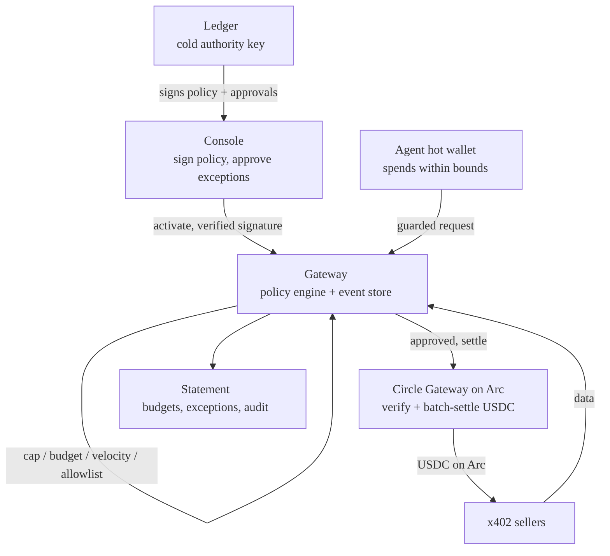
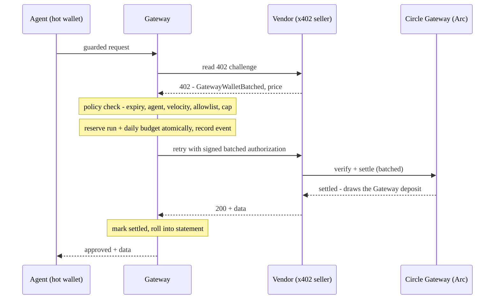

# Ledger Agent Payables

**A Ledger-signed policy control plane for AI-agent USDC nanopayments.**

A human signs one policy on a Ledger — allowed vendors, per-payment cap, daily budget, velocity, expiry — and a gateway enforces it on every agent payment, holds exceptions for human approval, and rolls events into an audit-ready statement.

## Problem

AI agents can now spend money automatically, creating a critical control problem:

- a runaway loop can drain a wallet one nanopayment at a time
- a compromised agent can pay an attacker-controlled endpoint
- raw wallet transactions are not enough for finance or audit

The fix: control moves up a level — a human signs the budget and rules once, and the system enforces them on every payment.

## Who It's For

- **Agent developers** who want to route paid requests through a policy-checked gateway instead of calling paid endpoints directly.
- **Operators** running autonomous research, data, monitoring, or coding agents.
- **Finance and ops teams** that need vendor-level budgets, exceptions, and audit trails.

## How It Works

The owner signs authority on a Ledger (cold key); the agent spends from a separate hot wallet, bounded by the signed policy. The gateway enforces every payment before money moves.



Each guarded payment follows a fail-closed critical path:



The same gateway runs on a local mock rail or Circle Arc testnet for real gas-free USDC nanopayments.

## Quickstart

Install and run the test suite:

```bash
npm install
npm test            # money-logic + gateway suite
```

### Run it on Circle Arc (testnet USDC)

1. Create and fund a throwaway buyer wallet:

```bash
npm run arc:wallet          # prints the buyer address
# fund that address at https://faucet.circle.com (select Arc Testnet)
npm run arc:wallet:status   # confirm the USDC balance landed
```

2. Start the Arc gateway and the browser console in **two separate terminals**:

```bash
# terminal 1 — gateway (deposits into Circle's Gateway, then settles nanopayments)
npm run server:arc

# terminal 2 — browser console
npm run console
```

3. Open `http://127.0.0.1:5173/console/`. Connect a Ledger (or a local test key), sign a policy, run the agent, approve exceptions, and watch budgets, statements, and live decisions.

### Optional: mock rail (no wallet, no funds)

The same gateway and console run against a deterministic, offline mock rail — useful to evaluate the full control flow with zero setup, and as a fallback if the testnet is unavailable. Identical UI; payments are simulated (no on-chain transaction).

```bash
npm run server:mock     # use instead of server:arc — they share port 4020, run only one
npm run console
```

Headless checks (optional, no browser): `npm run demo:mock` runs the full flow on the mock rail; `npm run demo:arc` settles one real Arc nanopayment from the command line.

## Demo

_Screenshot coming soon._

The demo flow:

1. Author a spend policy in the policy console.
2. Sign the policy on a Ledger device.
3. Let the agent make a gas-free USDC nanopayment on Arc testnet.
4. Show the on-chain Gateway deposit and the agent's budget drawing down.
5. Trigger an unknown-vendor or over-cap exception.
6. Sign a one-shot exception approval on Ledger.
7. Show the statement rollup.

## Project Layout

```text
console/    browser policy console for policy and exception signatures
core/       policy engine, gateway, signer, budget ledger, payment clients
scripts/    mock and Arc scenario runners
test/       policy, gateway, signing, budget, and exception tests
```

## Status and limitations

* Arc testnet only — public faucet funds, no real money.
* Paid services are self-hosted demo sellers (wrapping open-meteo), not third-party vendors.
* The agent is a deterministic script, not an LLM.
* In-memory state and demo wallets — not production software.

## Roadmap

* Real vendors — pay live x402 services from Circle's agent marketplace, replacing the demo sellers.
* Persistent state — move the in-memory store to Postgres, with atomic budget reservation in one transaction.
* EIP-712 signing — upgrade Ledger signatures from EIP-191 to typed-data for clearer on-device display.
* Mainnet rail — real USDC on Arc mainnet.
* Resilience — retry/backoff on Gateway API calls.
* Autonomous agent — swap the deterministic agent for an LLM that buys under the same policy.
